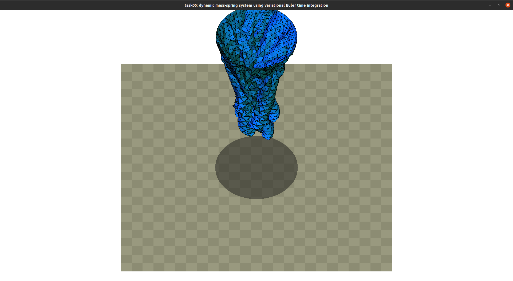
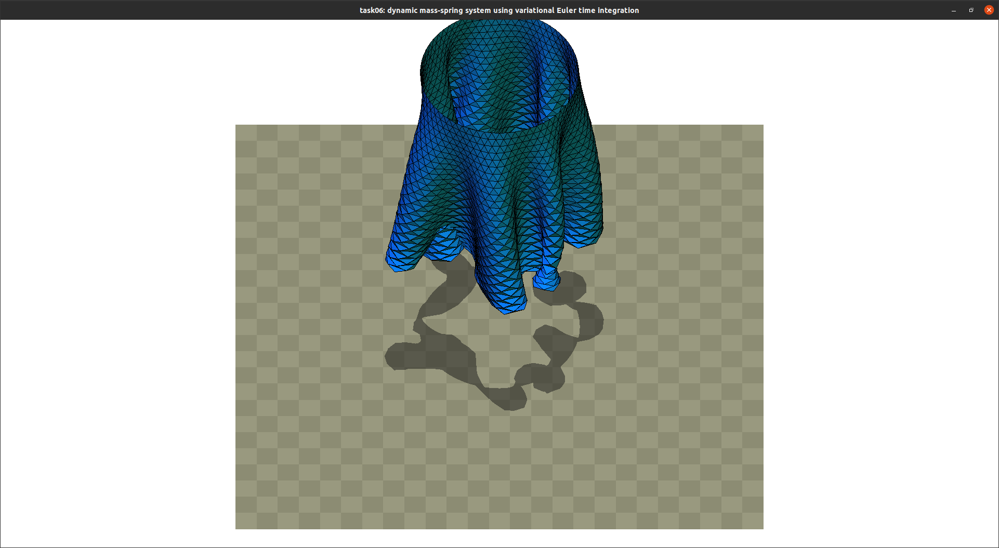

# Task05: Dynamic Mass-spring System using Variational Euler Time Integration


**Deadline: June 8th (Thu) at 15:00pm**

----

## Before Doing Assignment

If you have not done the [task00](../task00), do it first to set up the C++ graphics development environment.

Follow [this document](../doc/submit.md) to submit the assignment, In a nutshell, before doing the assignment,

- install `eigen` library following  [this document](../doc/setup_eigen.md)
- make sure you synchronized the `main ` branch of your local repository  to that of remote repository.
- make sure you created branch `task06` from `main` branch.
- make sure you are currently in the `task06` branch (use `git branch -a` command).

Now you are ready to go!

---

## Problem 1

Run the code as it is .  After running the program for a while, the simulation stops. Then, take a screenshot image of a program window. 
Save the screenshot image overwriting `task06/problem1.png`




## Problem 2

This program means to compute dynamic animation of skirt as a mass-spring system. The program uses the variational Euler's method to compute implicit time integration. The variational problem is solved using the Newton's method.  

The current code does not compute the hessian of the elastic energy of the spring very accurately so the simulation is unstable.

Write a few lines of code around `line #52` to compute hessian accurately. After running the program for a while, save the screenshot image overwriting `task06/problem2.png`



Write down the converged minimum value of the energy by updating the text below.

It didn't converged, so I paste the stdout of the program.
```
time: 0.13   elastic_energy: 3.43903e-13
time: 0.26   elastic_energy: -0.691962
time: 0.39   elastic_energy: -1.72368
time: 0.52   elastic_energy: -3.07528
time: 0.65   elastic_energy: -4.73177
time: 0.78   elastic_energy: -6.68157
time: 0.91   elastic_energy: -8.90478
time: 1.04   elastic_energy: -11.3819
time: 1.17   elastic_energy: -14.0925
time: 1.3   elastic_energy: -17.0159
time: 1.43   elastic_energy: -20.1303
time: 1.56   elastic_energy: -23.4135
time: 1.69   elastic_energy: -26.8427
time: 1.82   elastic_energy: -30.3947
time: 1.95   elastic_energy: -34.0457
time: 2.08   elastic_energy: -37.7717
time: 2.21   elastic_energy: -41.5486
time: 2.34   elastic_energy: -45.3525
time: 2.47   elastic_energy: -49.1595
time: 2.6   elastic_energy: -52.9451
time: 2.73   elastic_energy: -56.6844
time: 2.86   elastic_energy: -60.3528
time: 2.99   elastic_energy: -63.9257
time: 3.12   elastic_energy: -67.3783
time: 3.25   elastic_energy: -70.6859
time: 3.38   elastic_energy: -73.8238
time: 3.51   elastic_energy: -76.7676
time: 3.64   elastic_energy: -79.4924
time: 3.77   elastic_energy: -81.9737
time: 3.9   elastic_energy: -84.1871
time: 4.03   elastic_energy: -86.1084
time: 4.16   elastic_energy: -87.7132
time: 4.29   elastic_energy: -88.9772
time: 4.42   elastic_energy: -89.8763
time: 4.55   elastic_energy: -90.3864
time: 4.68   elastic_energy: -90.485
time: 4.81   elastic_energy: -90.1526
time: 4.94   elastic_energy: -89.3784
time: 5.07   elastic_energy: -88.1658
time: 5.2   elastic_energy: -86.5317
time: 5.33   elastic_energy: -84.4902
time: 5.46   elastic_energy: -82.0346
time: 5.59   elastic_energy: -79.1297
time: 5.72   elastic_energy: -75.7174
time: 5.85   elastic_energy: -71.7321
time: 5.98   elastic_energy: -67.1443
time: 6.11   elastic_energy: -62.0523
time: 6.24   elastic_energy: -56.7611
time: 6.37   elastic_energy: -51.7084
time: 6.5   elastic_energy: -47.381
time: 6.63   elastic_energy: -43.4331
time: 6.76   elastic_energy: 1.41874
time: 6.89   elastic_energy: -41.4816
time: 7.02   elastic_energy: -42.313
time: 7.15   elastic_energy: -40.4155
time: 7.28   elastic_energy: -41.7684
time: 7.41   elastic_energy: -41.7692
time: 7.54   elastic_energy: -41.8799
time: 7.67   elastic_energy: -42.4095
time: 7.8   elastic_energy: -43.3144
time: 7.93001   elastic_energy: -44.5566
time: 8.06001   elastic_energy: -46.2021
time: 8.19001   elastic_energy: -48.2695
time: 8.32001   elastic_energy: -50.7645
time: 8.45001   elastic_energy: -53.6848
time: 8.58001   elastic_energy: -56.9945
time: 8.71001   elastic_energy: -60.6649
time: 8.84001   elastic_energy: -64.6221
time: 8.97001   elastic_energy: -68.7697
time: 9.10001   elastic_energy: -73.0168
time: 9.23001   elastic_energy: -77.2459
time: 9.36001   elastic_energy: -81.3249
time: 9.49001   elastic_energy: -85.1301
time: 9.62001   elastic_energy: -88.5632
time: 9.75001   elastic_energy: -91.5732
time: 9.88001   elastic_energy: -94.1248
time: 10.01   elastic_energy: -96.1961
time: 10.14   elastic_energy: -97.8022
time: 10.27   elastic_energy: -98.9771
time: 10.4   elastic_energy: -99.7556
time: 10.53   elastic_energy: -100.184
time: 10.66   elastic_energy: -100.29
time: 10.79   elastic_energy: -100.089
time: 10.92   elastic_energy: -99.601
time: 11.05   elastic_energy: -98.8384
time: 11.18   elastic_energy: -97.7998
time: 11.31   elastic_energy: -96.4861
time: 11.44   elastic_energy: -94.9125
time: 11.57   elastic_energy: -93.1001
time: 11.7   elastic_energy: -91.0722
time: 11.83   elastic_energy: -88.8576
time: 11.96   elastic_energy: -86.4945
time: 12.09   elastic_energy: -84.0261
time: 12.22   elastic_energy: -81.4944
time: 12.35   elastic_energy: -78.9428
time: 12.48   elastic_energy: -76.4147
time: 12.61   elastic_energy: -73.9458
time: 12.74   elastic_energy: -71.5638
time: 12.87   elastic_energy: -69.2922
time: 13   elastic_energy: -67.154
time: 13.13   elastic_energy: -65.167
time: 13.26   elastic_energy: -63.3432
time: 13.39   elastic_energy: -61.6906
time: 13.52   elastic_energy: -60.2159
time: 13.65   elastic_energy: -58.9208
time: 13.78   elastic_energy: -57.8093
time: 13.91   elastic_energy: -56.8787
time: 14.04   elastic_energy: -56.1245
time: 14.17   elastic_energy: -55.546
time: 14.3   elastic_energy: -55.1364
time: 14.43   elastic_energy: -54.8949
time: 14.56   elastic_energy: -54.8186
time: 14.69   elastic_energy: -54.9022
time: 14.82   elastic_energy: -55.1438
time: 14.95   elastic_energy: -55.5477
time: 15.08   elastic_energy: -56.1097
time: 15.21   elastic_energy: -56.8273
time: 15.34   elastic_energy: -57.7024
time: 15.47   elastic_energy: -58.7223
time: 15.6   elastic_energy: -59.8806
time: 15.73   elastic_energy: -61.184
time: 15.86   elastic_energy: -62.6254
time: 15.99   elastic_energy: -64.1949
time: 16.12   elastic_energy: -65.8823
time: 16.25   elastic_energy: -67.6658
time: 16.38   elastic_energy: -69.5483
time: 16.51   elastic_energy: -71.5227
time: 16.64   elastic_energy: -73.5724
time: 16.77   elastic_energy: -75.6903
time: 16.9   elastic_energy: -77.8574
time: 17.03   elastic_energy: -80.0426
time: 17.16   elastic_energy: -82.2376
time: 17.29   elastic_energy: -84.4239
time: 17.42   elastic_energy: -86.5977
time: 17.55   elastic_energy: -88.7344
time: 17.68   elastic_energy: -90.7578
time: 17.81   elastic_energy: -92.65
time: 17.94   elastic_energy: -94.3908
time: 18.07   elastic_energy: -95.9714
time: 18.2   elastic_energy: -97.3279
time: 18.33   elastic_energy: -98.411
time: 18.46   elastic_energy: -99.2356
time: 18.59   elastic_energy: -99.7823
time: 18.72   elastic_energy: -99.9294
time: 18.85   elastic_energy: -99.73
time: 18.98   elastic_energy: -99.1922
time: 19.11   elastic_energy: -98.3269
time: 19.24   elastic_energy: -97.1567
time: 19.37   elastic_energy: -95.7645
time: 19.5   elastic_energy: -94.3691
time: 19.63   elastic_energy: -93.0068
time: 19.76   elastic_energy: -91.7028
time: 19.89   elastic_energy: -90.4374
time: 20.02   elastic_energy: -89.2447
time: 20.15   elastic_energy: -87.9793
time: 20.28   elastic_energy: -86.6873
time: 20.41   elastic_energy: -85.2346
time: 20.54   elastic_energy: -83.82
time: 20.67   elastic_energy: -82.3341
time: 20.8   elastic_energy: -80.752
time: 20.93   elastic_energy: -79.1594
time: 21.06   elastic_energy: -77.6264
time: 21.19   elastic_energy: -76.2114
time: 21.32   elastic_energy: -74.9716
time: 21.45   elastic_energy: -73.9428
time: 21.58   elastic_energy: -73.1718
time: 21.71   elastic_energy: -72.7067
time: 21.84   elastic_energy: -72.5783
time: 21.97   elastic_energy: -72.7974
time: 22.1   elastic_energy: -73.3556
time: 22.23   elastic_energy: -74.2297
time: 22.36   elastic_energy: -75.3867
time: 22.49   elastic_energy: -76.7756
time: 22.62   elastic_energy: -78.3378
time: 22.75   elastic_energy: -80.0353
time: 22.88   elastic_energy: -81.7992
time: 23.01   elastic_energy: -83.5826
time: 23.14   elastic_energy: -85.3635
time: 23.27   elastic_energy: -87.1032
time: 23.4   elastic_energy: -88.7987
time: 23.53   elastic_energy: -90.4535
time: 23.66   elastic_energy: -92.0638
time: 23.79   elastic_energy: -93.6251
time: 23.92   elastic_energy: -95.1311
time: 24.05   elastic_energy: -96.5797
time: 24.18   elastic_energy: -97.9439
time: 24.31   elastic_energy: -99.2094
time: 24.44   elastic_energy: -100.346
time: 24.57   elastic_energy: -101.315
time: 24.7   elastic_energy: -102.092
time: 24.83   elastic_energy: -102.652
time: 24.96   elastic_energy: -102.981
time: 25.09   elastic_energy: -103.069
time: 25.22   elastic_energy: -102.918
time: 25.35   elastic_energy: -102.539
time: 25.48   elastic_energy: -101.948
time: 25.61   elastic_energy: -101.164
time: 25.74   elastic_energy: -100.211
time: 25.8699   elastic_energy: -99.112
time: 25.9999   elastic_energy: -97.8928
time: 26.1299   elastic_energy: -96.5787
time: 26.2599   elastic_energy: -95.1947
time: 26.3899   elastic_energy: -93.7645
time: 26.5199   elastic_energy: -92.3106
time: 26.6499   elastic_energy: -90.8539
time: 26.7799   elastic_energy: -89.413
time: 26.9099   elastic_energy: -88.0048
time: 27.0399   elastic_energy: -86.6471
time: 27.1699   elastic_energy: -85.3555
time: 27.2999   elastic_energy: -84.1434
time: 27.4299   elastic_energy: -83.0233
time: 27.5599   elastic_energy: -82.0068
time: 27.6899   elastic_energy: -81.104
time: 27.8199   elastic_energy: -80.3237
time: 27.9499   elastic_energy: -79.6731
time: 28.0799   elastic_energy: -79.1585
time: 28.2099   elastic_energy: -78.7847
time: 28.3399   elastic_energy: -78.555
time: 28.4699   elastic_energy: -78.4711
time: 28.5999   elastic_energy: -78.5332
time: 28.7299   elastic_energy: -78.74
time: 28.8599   elastic_energy: -79.0882
time: 28.9899   elastic_energy: -79.5732
time: 29.1199   elastic_energy: -80.1907
time: 29.2499   elastic_energy: -80.9344
time: 29.3799   elastic_energy: -81.7959
time: 29.5099   elastic_energy: -82.7655
time: 29.6399   elastic_energy: -83.8326
time: 29.7699   elastic_energy: -84.9861
time: 29.8999   elastic_energy: -86.2137
time: 30.0299   elastic_energy: -87.5017
time: 30.1599   elastic_energy: -88.8364
time: 30.2899   elastic_energy: -90.2035
time: 30.4199   elastic_energy: -91.5879
time: 30.5499   elastic_energy: -92.9735
time: 30.6799   elastic_energy: -94.3435
time: 30.8099   elastic_energy: -95.6821
time: 30.9399   elastic_energy: -96.9737
time: 31.0699   elastic_energy: -98.2015
time: 31.1999   elastic_energy: -99.3505
time: 31.3299   elastic_energy: -100.401
time: 31.4599   elastic_energy: -101.337
time: 31.5899   elastic_energy: -102.145
time: 31.7199   elastic_energy: -102.807
time: 31.8499   elastic_energy: -103.307
time: 31.9799   elastic_energy: -103.632
time: 32.1099   elastic_energy: -103.765
time: 32.2399   elastic_energy: -103.705
time: 32.3699   elastic_energy: -103.458
time: 32.4999   elastic_energy: -103.028
time: 32.6299   elastic_energy: -102.424
time: 32.7599   elastic_energy: -101.66
time: 32.8899   elastic_energy: -100.747
time: 33.0199   elastic_energy: -99.7054
time: 33.1499   elastic_energy: -98.576
time: 33.2799   elastic_energy: -97.3765
time: 33.4099   elastic_energy: -96.129
time: 33.5399   elastic_energy: -94.8561
time: 33.6699   elastic_energy: -93.5678
time: 33.7999   elastic_energy: -92.2845
time: 33.9299   elastic_energy: -91.0388
time: 34.0599   elastic_energy: -89.8507
time: 34.1899   elastic_energy: -88.7316
time: 34.3199   elastic_energy: -87.6936
time: 34.4499   elastic_energy: -86.7662
time: 34.5799   elastic_energy: -85.9602
time: 34.7099   elastic_energy: -85.287
time: 34.8399   elastic_energy: -84.7626
time: 34.9699   elastic_energy: -84.3996
time: 35.0999   elastic_energy: -84.2069
time: 35.2299   elastic_energy: -84.19
time: 35.3599   elastic_energy: -84.3506
time: 35.4899   elastic_energy: -84.6863
time: 35.6199   elastic_energy: -85.1912
time: 35.7499   elastic_energy: -85.8551
time: 35.8799   elastic_energy: -86.6637
time: 36.0099   elastic_energy: -87.5984
time: 36.1399   elastic_energy: -88.6376
time: 36.2699   elastic_energy: -89.7581
time: 36.3999   elastic_energy: -90.9372
time: 36.5299   elastic_energy: -92.1534
time: 36.6599   elastic_energy: -93.3868
time: 36.7899   elastic_energy: -94.6158
time: 36.9199   elastic_energy: -95.8219
time: 37.0499   elastic_energy: -96.9935
time: 37.18   elastic_energy: -98.1176
time: 37.31   elastic_energy: -99.1812
time: 37.44   elastic_energy: -100.17
time: 37.57   elastic_energy: -101.073
time: 37.7   elastic_energy: -101.876
time: 37.83   elastic_energy: -102.566
time: 37.96   elastic_energy: -103.138
time: 38.09   elastic_energy: -103.584
time: 38.22   elastic_energy: -103.894
time: 38.35   elastic_energy: -104.061
time: 38.48   elastic_energy: -104.089
time: 38.61   elastic_energy: -103.978
time: 38.74   elastic_energy: -103.73
time: 38.87   elastic_energy: -103.35
time: 39   elastic_energy: -102.847
time: 39.13   elastic_energy: -102.232
time: 39.26   elastic_energy: -101.519
time: 39.39   elastic_energy: -100.72
time: 39.52   elastic_energy: -99.8509
time: 39.65   elastic_energy: -98.9276
time: 39.78   elastic_energy: -97.9658
time: 39.91   elastic_energy: -96.9815
time: 40.04   elastic_energy: -95.9901
```

## After Doing the Assignment

After modifying the code, push the code and submit a pull request.


## Notes

- Do not submit multiple pull requests. Only the first pull request is graded
- Do not close the pull request by yourself. The instructor will close the pull request
- If you mistakenly merge the pull request, it's OK, but be careful not to merge next time. 
